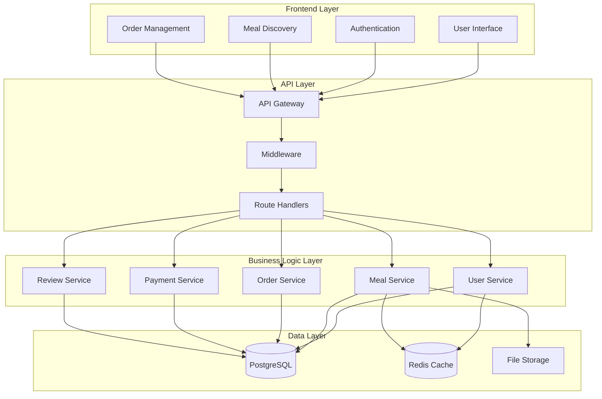
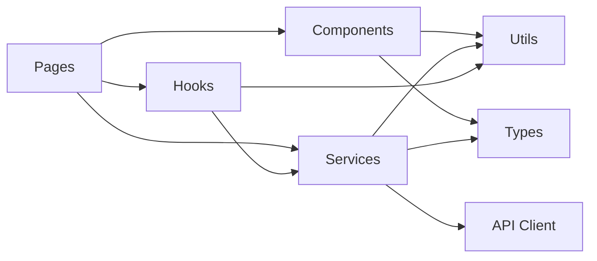
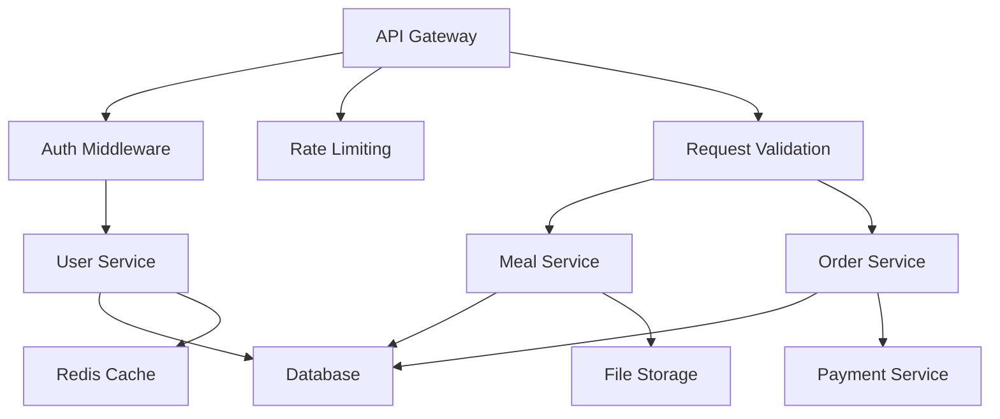

# 🗺️ Codebase Navigation Map

## 🎯 System Overview

The Local Home Cooked Meals Platform is a multi-layered application connecting home cooks with local food enthusiasts. This map provides AI agents with clear navigation paths and architectural understanding.

## 🏗️ High-Level Architecture



## 📁 Key Directory Structure

### Core Application (`src/`)

```
src/
├── components/          # 🧩 Reusable UI Components
│   ├── common/         # Shared components (Button, Modal, etc.)
│   ├── forms/          # Form components (LoginForm, OrderForm)
│   ├── layout/         # Layout components (Header, Footer, Sidebar)
│   └── specialized/    # Feature-specific components
├── pages/              # 📄 Route-Based Pages
│   ├── auth/          # Authentication pages
│   ├── meals/         # Meal discovery and details
│   ├── orders/        # Order management
│   ├── profile/       # User profiles
│   └── admin/         # Admin interface
├── services/           # 🔧 Business Logic & API
│   ├── api/           # API client functions
│   ├── auth/          # Authentication logic
│   ├── meals/         # Meal-related operations
│   ├── orders/        # Order processing
│   ├── payments/      # Payment handling
│   └── reviews/       # Review system
├── utils/              # 🛠️ Helper Functions
│   ├── formatters/    # Data formatting utilities
│   ├── validators/    # Input validation
│   ├── constants/     # Application constants
│   └── helpers/       # General helper functions
├── types/              # 📝 TypeScript Definitions
│   ├── api.ts         # API response types
│   ├── user.ts        # User-related types
│   ├── meal.ts        # Meal-related types
│   └── order.ts       # Order-related types
└── hooks/              # ⚛️ React Custom Hooks
    ├── useAuth.ts     # Authentication hook
    ├── useApi.ts      # API interaction hook
    └── useLocalStorage.ts # Local storage hook
```

### Context Documentation (`mise-en-place-output/`)

```
mise-en-place-output/
├── context-cards/      # 📋 Component Documentation
│   ├── architecture-overview.md
│   ├── code-standards.md
│   ├── component-structure.md
│   ├── context-summary.md
│   ├── deployment-guide.md
│   ├── project-glossary.md
│   ├── security-considerations.md
│   ├── testing-strategy.md
│   └── user-flows.md
├── context-templates/  # 📝 Development Templates
│   ├── menu_creation_context.md
│   ├── order_and_payment_system_context.md
│   ├── profile_management_context.md
│   └── reviews_and_ratings_context.md
├── prd/               # 📊 Product Requirements
│   └── local-home-cooked-meals-platform.md
└── tests/             # 🧪 Testing Framework
    ├── unit/
    ├── integration/
    └── e2e/
```

## 🔗 Component Dependencies

### Frontend Dependencies



### Service Layer Dependencies



## 🚪 Entry Points

### 1. Application Entry (`src/main.ts`)

- **Purpose**: Application bootstrap and initialization
- **Key Responsibilities**:
  - Framework setup (React/Vue)
  - Global configuration
  - Error boundary setup
  - Authentication initialization

### 2. API Entry (`src/api/index.ts`)

- **Purpose**: API server initialization
- **Key Responsibilities**:
  - Express server setup
  - Middleware configuration
  - Route registration
  - Database connection

### 3. Configuration (`src/config/`)

- **Purpose**: Environment and application configuration
- **Key Files**:
  - `database.ts` - Database connection settings
  - `auth.ts` - Authentication configuration
  - `payment.ts` - Payment provider settings

## 🔄 Data Flow Patterns

### User Authentication Flow

```
1. User Login Request → Auth Service
2. Validate Credentials → Database
3. Generate JWT Token → Token Service
4. Store Session → Redis Cache
5. Return Auth Response → Frontend
```

### Meal Discovery Flow

```
1. Search Request → Meal Service
2. Apply Filters → Query Builder
3. Database Query → PostgreSQL
4. Cache Results → Redis
5. Format Response → Frontend
```

### Order Processing Flow

```
1. Order Creation → Order Service
2. Validate Meal → Meal Service
3. Process Payment → Payment Service
4. Update Inventory → Database
5. Send Notifications → Notification Service
```

## 🔧 Integration Points

### External Services

- **Payment Processing**: Stripe/PayPal integration
- **File Storage**: AWS S3 or local storage
- **Email Service**: SendGrid or SMTP
- **Push Notifications**: Firebase or native
- **Maps/Location**: Google Maps API
- **Image Processing**: Sharp or ImageMagick

### Database Schema

- **Users**: Authentication and profile data
- **Meals**: Meal listings and metadata
- **Orders**: Order tracking and history
- **Reviews**: Rating and feedback system
- **Payments**: Transaction records

## 🎯 Critical Paths for AI Agents

### High-Priority Components

1. **Authentication System** (`src/services/auth/`)
   - User registration and login
   - JWT token management
   - Password reset functionality

2. **Meal Management** (`src/services/meals/`)
   - Meal creation and editing
   - Search and filtering
   - Image upload and processing

3. **Order Processing** (`src/services/orders/`)
   - Order lifecycle management
   - Payment integration
   - Status tracking

### Common Development Workflows

#### Adding a New Feature

1. Create types in `src/types/`
2. Implement service logic in `src/services/`
3. Create UI components in `src/components/`
4. Add pages in `src/pages/`
5. Write tests in `tests/`
6. Update documentation

#### Debugging Issues

1. Check browser console for frontend errors
2. Review API logs for backend issues
3. Verify database queries and connections
4. Test authentication and authorization
5. Validate external service integrations

## 📚 Documentation Cross-References

- **[Architecture Overview](./context-cards/architecture-overview.md)** - Detailed system design
- **[Code Standards](./context-cards/code-standards.md)** - Development guidelines
- **[Testing Strategy](./context-cards/testing-strategy.md)** - Testing approach
- **[User Flows](./context-cards/user-flows.md)** - User journey documentation
- **[Security Considerations](./context-cards/security-considerations.md)** - Security guidelines

## 🤖 AI Agent Quick Reference

### When Adding New Features

1. Check existing patterns in similar components
2. Follow established naming conventions
3. Add comprehensive tests
4. Update relevant documentation
5. Consider security implications

### When Debugging

1. Start with the entry points
2. Follow the data flow diagrams
3. Check integration points for failures
4. Review error logs systematically
5. Validate external dependencies

### When Refactoring

1. Understand component dependencies
2. Maintain existing interfaces
3. Update tests accordingly
4. Document architectural changes
5. Consider performance implications
