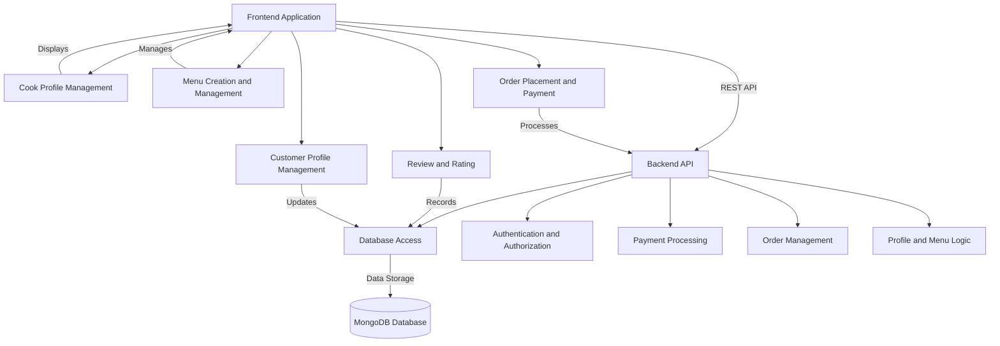

```markdown
# Local Home Cooking Platform Component Hierarchy Diagram

## System Overview
The Local Home Cooking Platform is a web application designed to connect local home cooks with nearby customers seeking authentic home-cooked meals. It provides functionalities for profile management, menu creation, ordering, payment processing, and mutual feedback through reviews. The architecture consists of a responsive frontend built with React, a scalable backend utilizing Node.js with Express.js, and a MongoDB database for dynamic data management.

## Component Layers

1. **UI Layer**
   - **Frontend Application**
     - Cook Profile Management
     - Menu Creation and Management
     - Order Placement and Payment
     - Review and Rating
     - Customer Profile Management

2. **Business Logic Layer**
   - **Backend API**
     - Authentication and Authorization
     - Payment Processing
     - Order Management
     - Profile and Menu Logic

3. **Data Layer**
   - **Database Access**
     - MongoDB Database

## Component Dependencies
- The **Frontend Application** relies on the **Backend API** for data retrieval and to perform business operations like authentication, order processing, etc.
- The **Backend API** interacts with the **Database** to store and retrieve user profiles, menu items, orders, reviews, and ratings.
- The **Payment Processing** component within the Business Logic Layer interfaces with third-party payment gateways for secure transactions.
  
## Component Responsibilities

- **Frontend Application**
  - Manages the user interface and experience.
  - Handles client-side operations for profile and order management.
  - Communicates with the Backend API via REST requests.

- **Backend API**
  - Processes business logic and manages core aspects of the platform.
  - Handles user authentication and payment verification.
  - Provides endpoints for frontend interaction and maintains data integrity.

- **Database Access**
  - Stores and manages data related to users, menu items, orders, and reviews.
  - Ensures efficient data retrieval and storage via a NoSQL structure.

## Mermaid Diagram



This diagram and breakdown provide a clear hierarchy of components, their interactions, and responsibilities in the Local Home Cooking Platform, ensuring a modular and maintainable architecture with clear separation of concerns and reusable components.