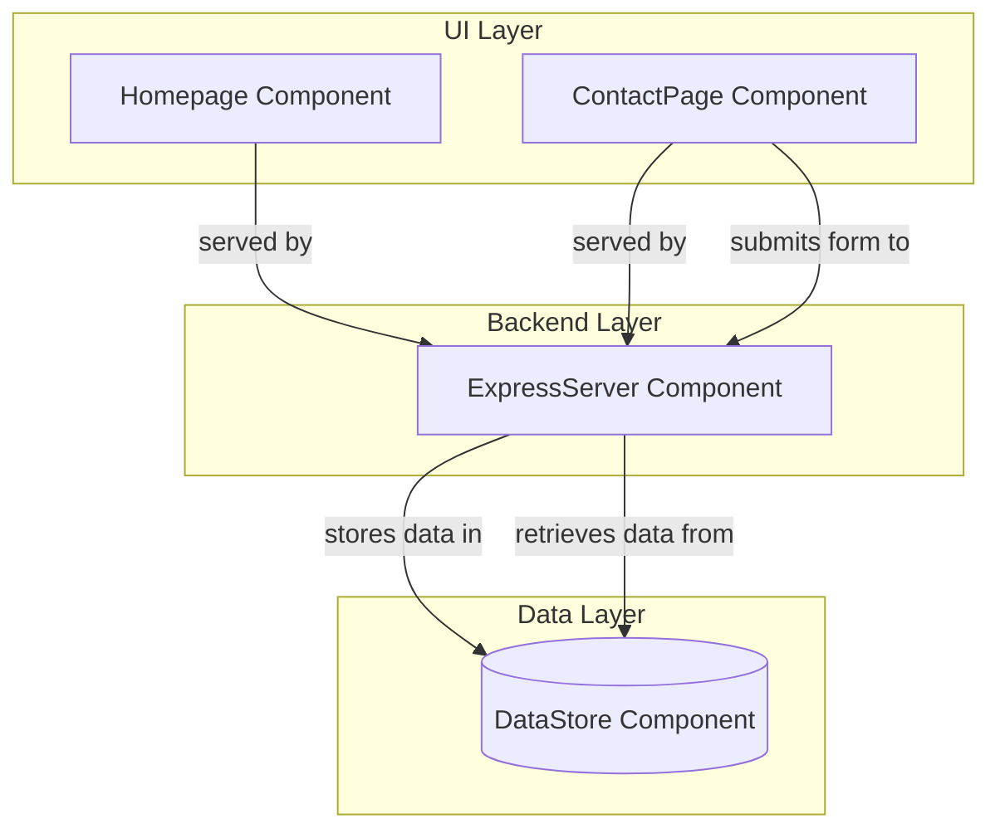

# Component Hierarchy for Simple Pizza Place Website

## System Overview
The Simple Pizza Place Website is designed as a lightweight web application focusing on providing essential information and a means of contact for customers. The system intends to utilize a straightforward architecture with an HTML/CSS frontend served by an Express.js backend, using in-memory SQLite for data handling.

## Component Layers

1. **UI Layer**
   - Responsible for rendering HTML/CSS pages for the homepage and contact page.
   - Includes static assets.
  
2. **Backend Layer**
   - Express.js Server handles HTTP requests and serves static files.
   - Responsible for routing and handling form submissions.

3. **Data Layer**
   - In-memory SQLite for storing and retrieving contact form submissions.
   - Temporary data storage that resets on server restart.

## Component Dependencies

- **UI Layer**:
  - Depends on the Backend Layer for serving HTML pages.
  - Interacts with Backend for form submission.

- **Backend Layer**:
  - Serves content to the UI Layer.
  - Manages data interactions with the Data Layer using SQLite.

## Component Responsibilities

- **HomePage Component**:
  - Renders static HTML to display general information about the pizza place.

- **ContactPage Component**:
  - Provides a form with fields for subject, phone number, and message.
  - Handles user inputs and validates data before submission.

- **ExpressServer Component**:
  - Serves static resources.
  - Manages routing between the homepage and contact page.
  - Processes and validates form submissions, then saves data to the Data Layer.

- **DataStore Component**:
  - Uses SQLite to temporarily store form submissions for the session duration.
  - Ensures data can be retrieved during server runtime.

## Mermaid Diagram

This component hierarchy outlines the clear separation of concerns and component interactions within the Simple Pizza Place Website. The architecture emphasizes scalability and maintainability, ensuring easy future enhancements and support for minimal traffic requirements.