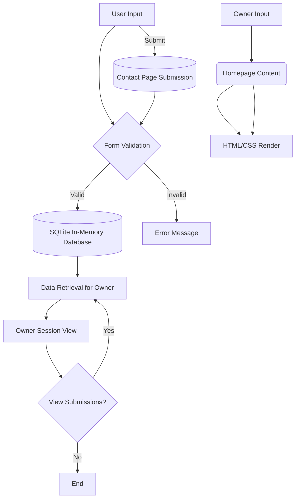

Below is a comprehensive data flow diagram in Markdown format for the Simple Pizza Place Website based on the provided PRD.

---

## Overview

The Simple Pizza Place Website is designed to provide a lightweight web presence with a static frontend and a simple backend. The system dynamically serves a homepage and a contact page, allowing customers to submit contact inquiries via a form. Data from these submissions is validated and temporarily stored in an in-memory SQLite database.

## Data Sources

- **User Input**: Contact form with fields for subject, phone number, and message.
- **Owner Input**: Static content creation for the homepage.

## Data Processing

1. **Frontend Render**: HTML and CSS are served by Express.js to display static pages.
2. **Form Submission**: User inputs are validated for basic formatting and security.
3. **Data Handling**: Valid submissions are processed and stored in SQLite.

## Data Storage

- **In-Memory Database**: SQLite stores contact form submissions for the duration of the server session.

## Data Outputs

- **Static Web Pages**: Information displayed on the homepage.
- **Form Acknowledgments**: Confirmation messages for successful submissions.

## Mermaid Diagram

---

This diagram provides a structured view of the system's data architecture, highlighting the interactiveness between user inputs, processing steps, storage, and outputs indicative of server-side handling. Make sure to align this implementation with future enhancements for scaling as outlined in the PRD.
