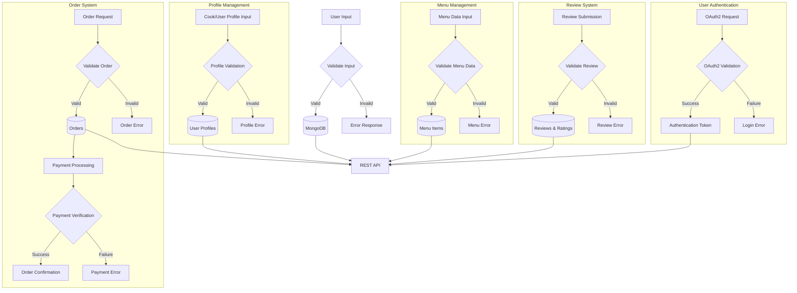

# Data Flow Diagram for Local Home Cooking Platform

## Overview
The Local Home Cooking Platform is designed to connect home cooks with local customers seeking authentic meals. The system architecture facilitates profile management, menu setup, secure transactions, and a rating system. The backend uses Node.js and Express.js, interfacing with a MongoDB database to manage user and transaction data, while the frontend employs React for a responsive user interface.

## Data Sources
- **External APIs**: OAuth2 provider for authentication
- **Databases**: MongoDB for storing user profiles, menu items, orders, and reviews
- **User Inputs**: Form submissions for profile management, menu creation, and customer feedback

## Data Processing
- **User Authentication**: Customer and cook login requests are validated against OAuth2.
- **Profile Management**: Profile data is collected or updated through user inputs and stored in the database.
- **Menu Management**: Query and update operations on menu items via structured JSON payloads.
- **Order System**: Transaction processing involving order creation, payment validation, and confirmation.
- **Rating System**: Post-transaction feedback is captured and analyzed for service improvements.

## Data Storage
- **User Profiles**: Stored as collections in MongoDB, preserving details like username, preferences, and cooking specialties.
- **Menu Items**: Menu data including names, descriptions, images, and pricing stored as JSON documents.
- **Orders and Transactions**: Order details and payment statuses are persistently maintained within database collections.
- **Reviews and Ratings**: Feedback and ratings managed as part of the user interaction data.

## Data Outputs
- **APIs**: Backend REST API endpoints facilitate operations like user authentication, profile management, and order processing.
- **UI Displays**: Frontend showcases profiles, menus, order histories, and rating data in a user-friendly design.
- **Reports**: Transaction summaries and user activity logs are generated for performance metrics analysis.

## Mermaid Diagram

This representation captures the flow of data from user input through processing, storage, and ultimately resulting in system outputs. The validation and decision points ensure robustness in handling user and transaction data, while maintaining a seamless user experience.